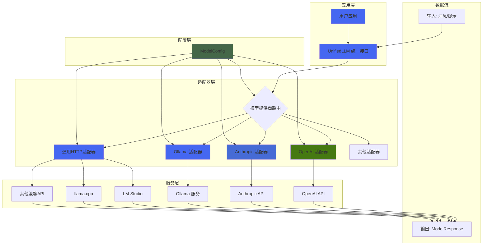
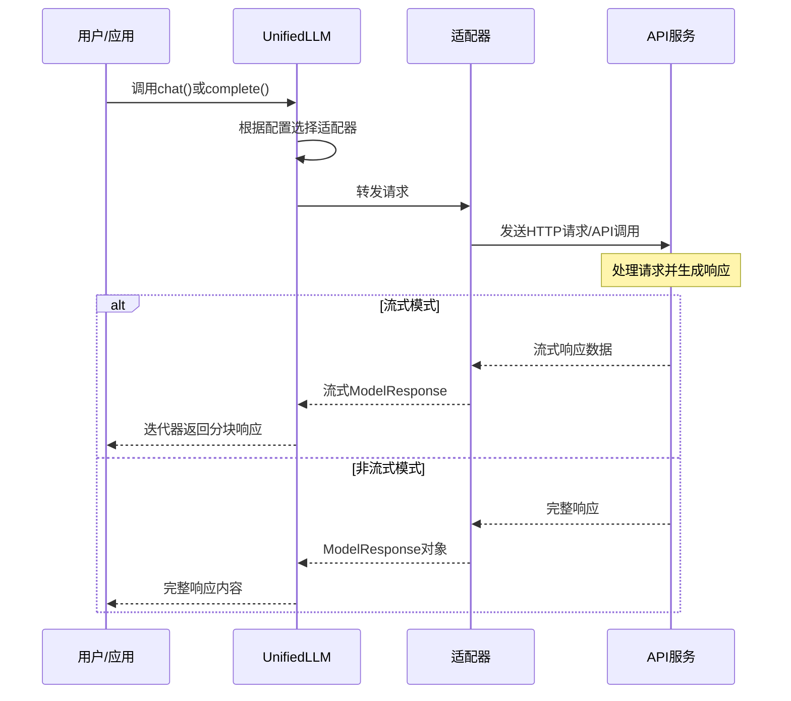
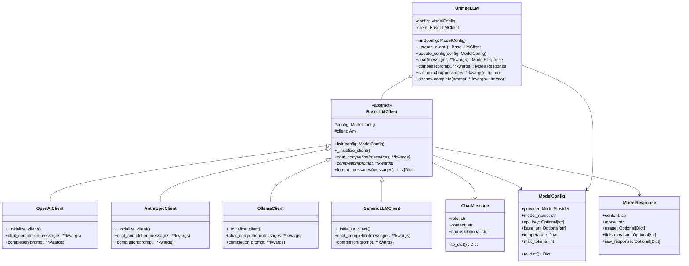

# 大语言模型调用框架架构图
general_text_ai_req.py

```mermaid
graph TB
    subgraph "应用层"
        A[用户应用] --> B[UnifiedLLM 统一接口]
    end

    subgraph "适配器层"
        B --> C{模型提供商路由}
        C --> D[OpenAI 适配器]
        C --> E[Anthropic 适配器]
        C --> F[Ollama 适配器]
        C --> G[通用HTTP适配器]
        C --> H[其他适配器]
    end

    subgraph "服务层"
        D --> I[OpenAI API]
        E --> J[Anthropic API]
        F --> K[Ollama 服务]
        G --> L[LM Studio]
        G --> M[llama.cpp]
        G --> N[其他兼容API]
    end

    subgraph "配置层"
        O[ModelConfig] --> C
        O --> D
        O --> E
        O --> F
        O --> G
    end

    subgraph "数据流"
        P[输入: 消息/提示] --> B
        I --> Q[输出: ModelResponse]
        J --> Q
        K --> Q
        L --> Q
        M --> Q
        N --> Q
    end

    style A fill:#4567f1
    style B fill:#4567f1
    style O fill:#456748
    style D fill:#457911
    style E fill:#466bd5
    style F fill:#4567f1
    style G fill:#4567f1
```

# 数据流图

```mermaid
sequenceDiagram
    participant User as 用户/应用
    participant UnifiedLLM as UnifiedLLM
    participant Adapter as 适配器
    participant API as API服务
    
    User->>UnifiedLLM: 调用chat()或complete()
    UnifiedLLM->>UnifiedLLM: 根据配置选择适配器
    UnifiedLLM->>Adapter: 转发请求
    Adapter->>API: 发送HTTP请求/API调用
    Note over API: 处理请求并生成响应
    
    alt 流式模式
        API-->>Adapter: 流式响应数据
        Adapter-->>UnifiedLLM: 流式ModelResponse
        UnifiedLLM-->>User: 迭代器返回分块响应
    else 非流式模式
        API-->>Adapter: 完整响应
        Adapter-->>UnifiedLLM: ModelResponse对象
        UnifiedLLM-->>User: 完整响应内容
    end
```
# 类关系图

```mermaid
classDiagram
    class ModelConfig {
        +provider: ModelProvider
        +model_name: str
        +api_key: Optional[str]
        +base_url: Optional[str]
        +temperature: float
        +max_tokens: int
        +to_dict() Dict
    }
    
    class ChatMessage {
        +role: str
        +content: str
        +name: Optional[str]
        +to_dict() Dict
    }
    
    class ModelResponse {
        +content: str
        +model: str
        +usage: Optional[Dict]
        +finish_reason: Optional[str]
        +raw_response: Optional[Dict]
    }
    
    class BaseLLMClient {
        <<abstract>>
        #config: ModelConfig
        #client: Any
        +__init__(config: ModelConfig)
        +_initialize_client()
        +chat_completion(messages, **kwargs)*
        +completion(prompt, **kwargs)*
        +format_messages(messages) List[Dict]
    }
    
    class UnifiedLLM {
        -config: ModelConfig
        -client: BaseLLMClient
        +__init__(config: ModelConfig)
        +_create_client() BaseLLMClient
        +update_config(config: ModelConfig)
        +chat(messages, **kwargs) ModelResponse
        +complete(prompt, **kwargs) ModelResponse
        +stream_chat(messages, **kwargs) Iterator
        +stream_complete(prompt, **kwargs) Iterator
    }
    
    class OpenAIClient {
        +_initialize_client()
        +chat_completion(messages, **kwargs)
        +completion(prompt, **kwargs)
    }
    
    class AnthropicClient {
        +_initialize_client()
        +chat_completion(messages, **kwargs)
        +completion(prompt, **kwargs)
    }
    
    class OllamaClient {
        +_initialize_client()
        +chat_completion(messages, **kwargs)
        +completion(prompt, **kwargs)
    }
    
    class GenericLLMClient {
        +_initialize_client()
        +chat_completion(messages, **kwargs)
        +completion(prompt, **kwargs)
    }
    
    BaseLLMClient <|-- OpenAIClient
    BaseLLMClient <|-- AnthropicClient
    BaseLLMClient <|-- OllamaClient
    BaseLLMClient <|-- GenericLLMClient
    UnifiedLLM o-- BaseLLMClient
    UnifiedLLM --> ModelConfig
    BaseLLMClient --> ModelConfig
    BaseLLMClient --> ChatMessage
    BaseLLMClient --> ModelResponse
```