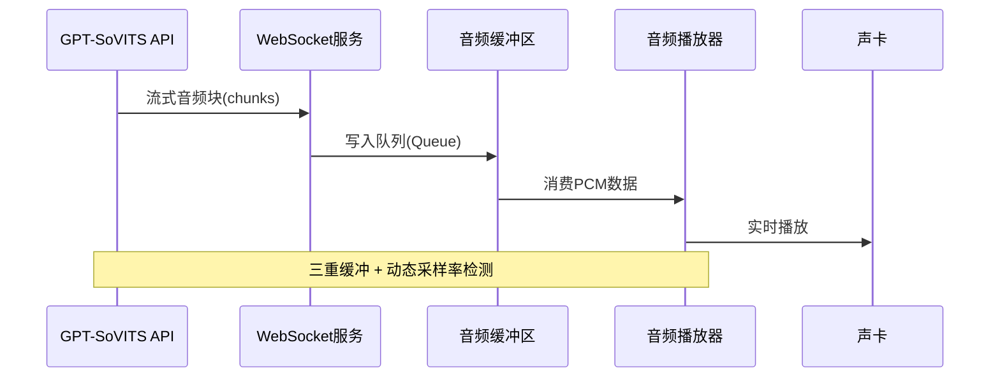

本模块为tts模块，即文本转语音模块。

本模块负责将来自AI的回复转为语音。

说明：
在本module当中，每个子模块的用途分别是：
- tts_core 对不同的tts的实现，提供相对统一的接口
    - gpt_sovits
        实现了gpt_sovits的tts接口封装

async_audio_player.py

```mermaid
sequenceDiagram
    participant TTS as GPT-SoVITS API
    participant WS as WebSocket服务
    participant Buffer as 音频缓冲区
    participant Player as 音频播放器
    
    TTS->>WS: 流式音频块(chunks)
    WS->>Buffer: 写入队列(Queue)
    Buffer->>Player: 消费PCM数据
    Player->>声卡: 实时播放
    
    Note over TTS,Player: 三重缓冲 + 动态采样率检测
```