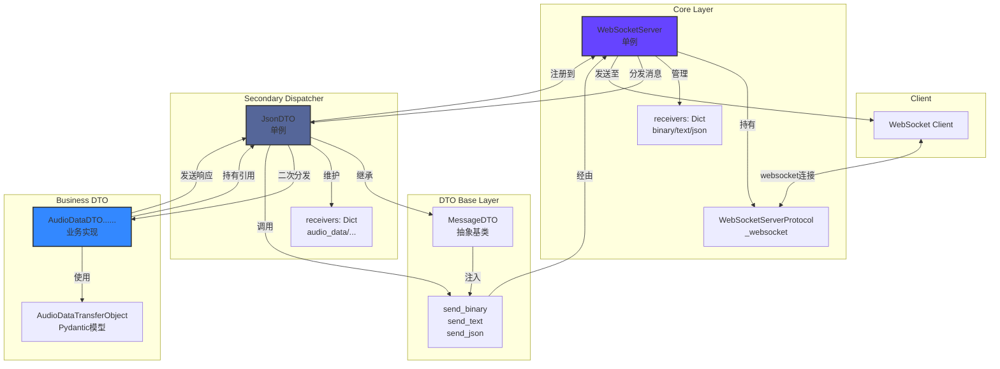

### 说明
在本module当中，每个子模块的用途分别是：
- dto
    - dto_templates
        服务端与客户端交互所使用到的数据传输对象
    - dto_base.py / xxx_dtos.py
        实际的DTO业务
- websocket_core
    - websocket核心，承载了底层核心的网络收发业务

### 模块架构

```mermaid
graph TB
    subgraph "Client"
        C[WebSocket Client]
    end

    subgraph "Core Layer"
        WS[WebSocketServer<br/>单例]
        WS -->|持有| WSP[WebSocketServerProtocol<br/>_websocket]
        WS -->|管理| RCV[ receivers: Dict<br/>binary/text/json ]
    end

    subgraph "DTO Base Layer"
        MDTO[MessageDTO<br/>抽象基类]
        MDTO -->|注入| MDF[ send_binary<br/>send_text<br/>send_json ]
    end

    subgraph "Secondary Dispatcher"
        JDTO[JsonDTO<br/>单例]
        JDTO -->|继承| MDTO
        JDTO -->|维护| MAP[ receivers: Dict<br/>audio_data/... ]
        JDTO -->|注册到| WS
    end

    subgraph "Business DTO"
        ADTO[AudioDataDTO......<br/>业务实现]
        ADTO -->|持有引用| JDTO
        ADTO -->|使用| ATO[AudioDataTransferObject<br/>Pydantic模型]
    end

    C <-->|websocket连接| WSP
    
    WS -->|分发消息| JDTO
    JDTO -->|二次分发| ADTO
    
    ADTO -->|发送响应| JDTO
    JDTO -->|调用| MDF
    MDF -->|经由| WS
    WS -->|发送至| C

    style WS fill:#64f,stroke:#333,stroke-width:2px
    style JDTO fill:#569,stroke:#333,stroke-width:2px
    style ADTO fill:#38f,stroke:#333,stroke-width:2px
```