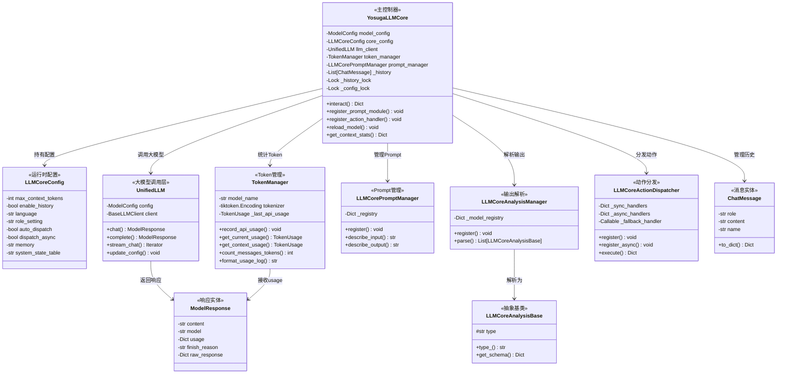
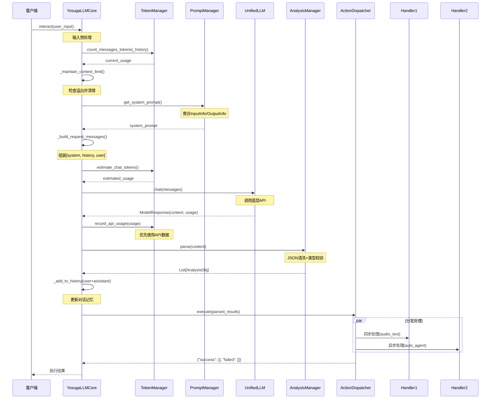
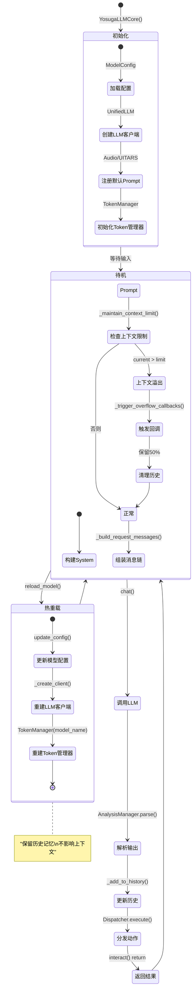

### 服务端llm核心
服务端以AI为核心去驱动，进行各种调用。

本模块为服务端的核心llm模块，这个llm必须足够聪明，能够稳定返回结构化结构。

llm_core负责实现：

#### 类图

```mermaid
classDiagram
    class YosugaLLMCore {
        <<主控制器>>
        -ModelConfig model_config
        -LLMCoreConfig core_config
        -UnifiedLLM llm_client
        -TokenManager token_manager
        -LLMCorePromptManager prompt_manager
        -List[ChatMessage] _history
        -Lock _history_lock
        -Lock _config_lock
        +interact() Dict
        +register_prompt_module() void
        +register_action_handler() void
        +reload_model() void
        +get_context_stats() Dict
    }

    class LLMCoreConfig {
        <<运行时配置>>
        -int max_context_tokens
        -bool enable_history
        -str language
        -str role_setting
        -bool auto_dispatch
        -bool dispatch_async
        -str memory
        -str system_state_table
    }

    class UnifiedLLM {
        <<大模型调用层>>
        -ModelConfig config
        -BaseLLMClient client
        +chat() ModelResponse
        +complete() ModelResponse
        +stream_chat() Iterator
        +update_config() void
    }

    class TokenManager {
        <<Token管理>>
        -str model_name
        -tiktoken.Encoding tokenizer
        -TokenUsage _last_api_usage
        +record_api_usage() void
        +get_current_usage() TokenUsage
        +get_context_usage() TokenUsage
        +count_messages_tokens() int
        +format_usage_log() str
    }

    class LLMCorePromptManager {
        <<Prompt管理>>
        -Dict _registry
        +register() void
        +describe_input() str
        +describe_output() str
    }

    class LLMCoreAnalysisManager {
        <<输出解析>>
        <<静态类>>
        -Dict _model_registry
        +register() void
        +parse() List[LLMCoreAnalysisBase]
    }

    class LLMCoreActionDispatcher {
        <<动作分发>>
        <<静态类>>
        -Dict _sync_handlers
        -Dict _async_handlers
        -Callable _fallback_handler
        +register() void
        +register_async() void
        +execute() Dict
    }

    class LLMCoreAnalysisBase {
        <<抽象基类>>
        <<模型数据基类>>
        #str type
        +type_() str
        +get_schema() Dict
    }

    class ChatMessage {
        <<消息实体>>
        -str role
        -str content
        -str name
        +to_dict() Dict
    }

    class ModelResponse {
        <<响应实体>>
        -str content
        -str model
        -Dict usage
        -str finish_reason
        -Dict raw_response
    }

    YosugaLLMCore --> LLMCoreConfig : 持有配置
    YosugaLLMCore --> UnifiedLLM : 调用大模型
    YosugaLLMCore --> TokenManager : 统计Token
    YosugaLLMCore --> LLMCorePromptManager : 管理Prompt
    YosugaLLMCore --> LLMCoreAnalysisManager : 解析输出
    YosugaLLMCore --> LLMCoreActionDispatcher : 分发动作
    YosugaLLMCore --> ChatMessage : 管理历史
    UnifiedLLM --> ModelResponse : 返回响应
    LLMCoreAnalysisManager --> LLMCoreAnalysisBase : 解析为
    TokenManager --> ModelResponse : 接收usage
```

#### 时序图

```mermaid
sequenceDiagram
    participant Client as 客户端
    participant Core as YosugaLLMCore
    participant Token as TokenManager
    participant Prompt as PromptManager
    participant LLM as UnifiedLLM
    participant Parser as AnalysisManager
    participant Dispatcher as ActionDispatcher

    Client->>Core: interact(user_input)
    Note over Core: 输入预处理
    
    Core->>Token: count_messages_tokens(_history)
    Token-->>Core: current_usage
    
    Core->>Core: _maintain_context_limit()
    Note over Core: 检查溢出并清理
    
    Core->>Prompt: get_system_prompt()
    Note over Prompt: 聚合InputInfo/OutputInfo
    
    Prompt-->>Core: system_prompt
    
    Core->>Core: _build_request_messages()
    Note over Core: 组装[system, history, user]
    
    Core->>Token: estimate_chat_tokens()
    Token-->>Core: estimated_usage
    
    Core->>LLM: chat(messages)
    Note over LLM: 调用底层API
    
    LLM-->>Core: ModelResponse(content, usage)
    
    Core->>Token: record_api_usage(usage)
    Note over Token: 优先使用API数据
    
    Core->>Parser: parse(content)
    Note over Parser: JSON清洗+类型校验
    
    Parser-->>Core: List[AnalysisObj]
    
    Core->>Core: _add_to_history(user+assistant)
    Note over Core: 更新对话记忆
    
    Core->>Dispatcher: execute(parsed_results)
    
    par 分发处理
        Dispatcher->>Handler1: 同步处理(audio_text)
        Dispatcher->>Handler2: 异步处理(auto_agent)
    end
    
    Dispatcher-->>Core: {"success": [], "failed": []}
    
    Core-->>Client: 执行结果
```

#### 配置与模型热重载状态机

```mermaid
stateDiagram-v2
    [*] --> 初始化: YosugaLLMCore()
    
    state 初始化 {
        [*] --> 加载配置: ModelConfig
        加载配置 --> 创建LLM客户端: UnifiedLLM
        创建LLM客户端 --> 注册默认Prompt: Audio/UITARS
        注册默认Prompt --> 初始化Token管理器: TokenManager
    }
    
    初始化 --> 待机: 等待输入
    
    state 待机 {
        [*] --> 构建System Prompt
        构建System Prompt --> 检查上下文限制: _maintain_context_limit()
        检查上下文限制 --> 上下文溢出: current > limit
        检查上下文限制 --> 正常: 否则
        
        上下文溢出 --> 触发回调: _trigger_overflow_callbacks()
        触发回调 --> 清理历史: 保留50%
        清理历史 --> 正常
        
        正常 --> 组装消息链: _build_request_messages()
    }
    
    待机 --> 调用LLM: chat()
    
    调用LLM --> 解析输出: AnalysisManager.parse()
    
    解析输出 --> 更新历史: _add_to_history()
    
    更新历史 --> 分发动作: Dispatcher.execute()
    
    分发动作 --> 返回结果: interact() return
    
    返回结果 --> 待机
    
    待机 --> 热重载: reload_model()
    
    state 热重载 {
        [*] --> 更新模型配置: update_config()
        更新模型配置 --> 重建LLM客户端: _create_client()
        重建LLM客户端 --> 重建Token管理器: TokenManager(model_name)
        重建Token管理器 --> [*]
    }
    
    热重载 --> 待机
    
    note right of 热重载 : "保留历史记忆\n不影响上下文"
```